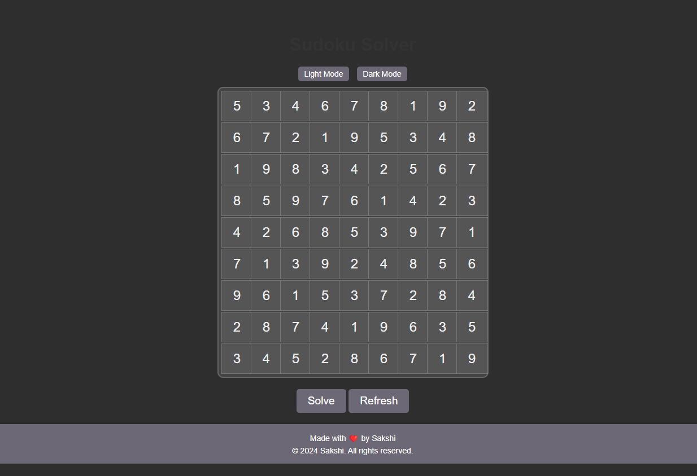

# SudokuX

## Description

The Sudoku Solver application is a web-based tool designed to help you solve Sudoku puzzles efficiently. This intuitive and visually appealing application allows you to input your Sudoku puzzle, solve it with a single click, and reset the board for a new puzzle. Additionally, the app includes a light/dark mode toggle to enhance user experience according to your preference.

## Features

- **Sudoku Board**:
  - A 9x9 grid where you can input your Sudoku puzzle.
  - Clear and responsive design with focus effects for better usability.

- **Solve Button**:
  - Solves the Sudoku puzzle instantly.
  - Alerts you if no solution is found.

- **Refresh Button**:
  - Clears the Sudoku board for a new puzzle.

- **Light/Dark Mode Toggle**:
  - Switch between light and dark modes to suit your viewing preferences.
  - Light mode: Classic, clean, and bright.
  - Dark mode: Eye-friendly for low-light environments.

- **Footer**:
  - Contains credits and a link to the source code on GitHub.

## How to Use

1. **Input the Puzzle**:
   - Click on any cell in the 9x9 grid and enter a number between 1 and 9.
   - Leave cells blank if they are empty in your puzzle.

2. **Solve the Puzzle**:
   - Click the “Solve” button to see the solution.
   - If the puzzle has no valid solution, you will be alerted.

3. **Refresh the Board**:
   - Click the “Refresh” button to clear all inputs and start a new puzzle.

4. **Toggle Light/Dark Mode**:
   - Click “Light Mode” or “Dark Mode” buttons to switch between modes.

## Technology Used

- **HTML**: Structure of the application.
- **CSS**: Styling for light and dark modes, buttons, and layout.
- **JavaScript**: Functionality for solving the puzzle, toggling modes, and refreshing the board.

## Getting Started

To get started with the Sudoku Solver application, follow these steps:

1. Clone the repository:
   ```bash
   git clone https://github.com/krsakshi/sudoku-solver.git

<h2>Screenshots</h2> <div class="screenshots"><h3>Light Mode</h3>  <h3>Dark Mode</h3></div> 

<h2> Deployment</h2>
<P> To Solve a suduko Problem or view the project <a href="https://suduko-solver-teal.vercel.app/">Click Here</a> </P>
<h2>License</h2> <p> This project is licensed under the MIT License. See the <a href="https://github.com/krsakshi/Suduko-Solver/blob/main/LICENSE">LICENSE</a> file for details. </p>


